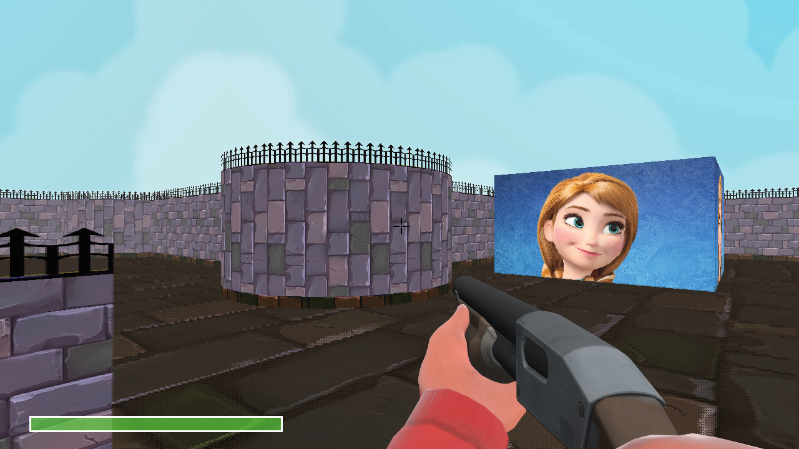
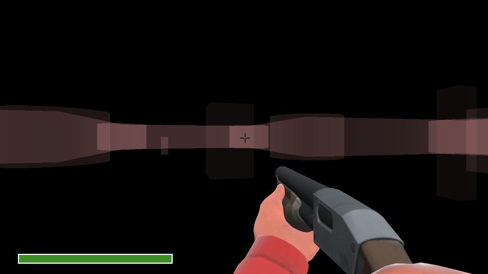
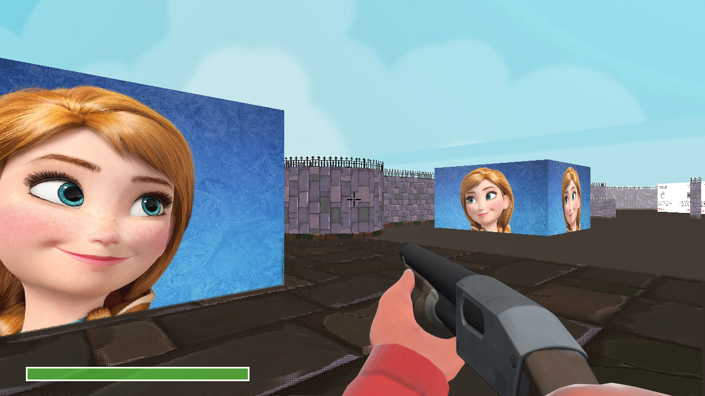
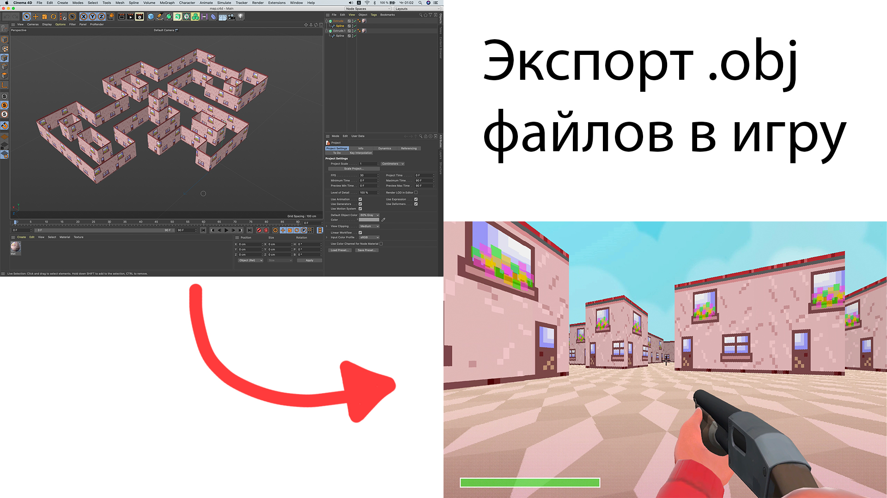

# pseudo3DEngine
Simple pseudo-3d shooter implementation. 
You can make two dimensional map, add enemy's, shoot and draw pseudo 3D image using Ray-Cast.

<h4>Installation:</h4>

1) Download and install OpenAL library for SFML sound support (in current version you can't setup this engine without OpenAL)

   openal: https://openal.org/downloads/

2) Install SFML on your computer (<b>The compiler versions have to match 100%</b>):

   sfml: https://www.sfml-dev.org/download.php

2) Open CLion or Visual Studio

   CLion (recommended): https://www.jetbrains.com/clion/

   Visual Studio: https://visualstudio.microsoft.com/ru/

4) Built project

For any issues, please, create new issue in this repository.

Demonstration of how does this engine work:

Some results of texturing:

We can switch off the textures:

We can smooth floor (performance-heavy):

This engine can perfom some mirrors. As you can see, we get correct reflection image:

Reflection loop included:

Online test:

Jumps (but without camera vertical rotation):

Map editor (importing .obj files):

